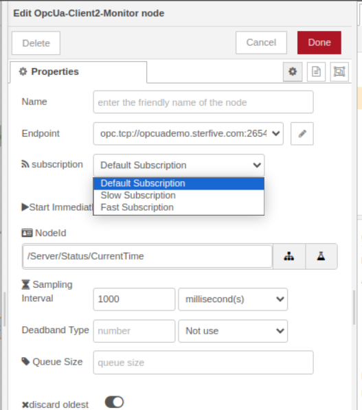

### Node palette

### specifying a endpoint connection

> the `check connection` button allows you to immediately test your connection parameters and provide useful feedback to help you fix commonly found issues. 

Three default subscriptions are automatically created for you: 
Default (1 seconde), Fast (500ms) and Slow(5 secondes). They provide different publishing intervals for the most common scenarios we usually find in typical IIoT applications. You can customize the parameter or delete or add new subscriptions if you wish. 
Most of the time, only a few subscriptions are needed. 

Note: The default subscription cannot be deleted, it serves as a mechanism to keep the connection always active with the server by handling a keepalive packet, and serves as well in the automatic reconnection mechanism, in case of a network outage. 

## setting up custom certificate

We provide a single PKI location shared with all Client connections.
The PKI is located in the following folder:

- Linux: `~/.node-red/opcua-for-node-red/PKI` folder
- macOS: `~/Library/Preferences/opcua-for-node-red-nodejs/PKI`
- Windows: `%APPDATA%\opcua-for-node-red-nodejs\PKI` (for example, `C:\Users\USERNAME\AppData\Roaming\opcua-for-node-red-nodejs\PKI`)

## Read

**NodeId** : you can specify here a nodeId or a browsePath (originated from the /Objects folder) or both.

For instance:

   - ns=1;s=Temperature
   - /2:MyDevice/1:MyTemperatureSensor/2:ParameterSet/3:Temperature
   - \[/2:MyDevice/1:MyTemperatureSensor/2:ParameterSet/3:Temperature\](ns=1;s=Temperature)

You can also client on the `...` button to browse the OPCUA server and pick up the nodeId you are interested in.

**Note**: NodeID can also be left empty, if you intend to inject the NodeId by the `topic` attribute of an Inject node or with a OpcUa-Item.

## Write

## Call

## Monitor Variable

## Monitor Event
