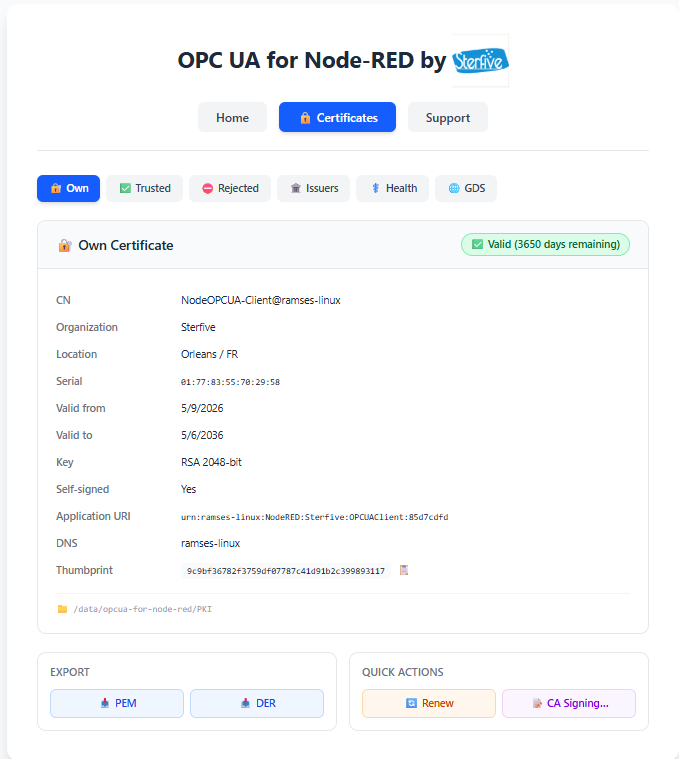
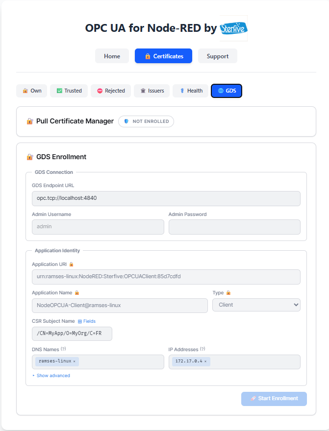
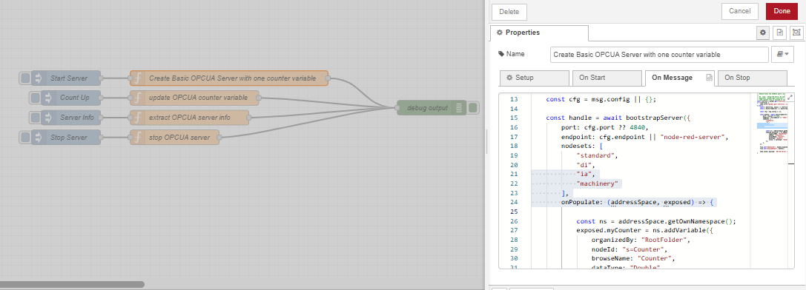

@opcua/for-node-red

# The Industrial-Grade OPC UA Node for Node-RED.


Powered by NodeOPCUA—the industry-standard OPC UA stack for Node.js—and maintained by its original creators, Sterfive.

## 🎬 Watch the presentation

[](https://youtu.be/NtA5KIaE3R4?si=TyrZZFhCO9w-07gL)


## 🚀 Why choose this over the free open-source alternative?

While legacy community nodes (like node-red-contrib-opcua) have served the hobbyist community well, @opcua/for-node-red is architected for high-performance industrial environments.

We focus on optimization, stability, and handling the complex data structures found in modern PLCs (Siemens S7-1500, Rockwell, Omron).

## Feature Comparison


| Feature               | Legacy Community Nodes      | @opcua/for-node-red (This Module)                          |
|-----------------------|-----------------------------|------------------------------------------------------------|
| Complex Data (UDTs)   | ❌ Manual parsing required   | ✅ **Native Extension Objects** (Reads full structures as JSON) |
| Addressing            | ⚠️ Usually NodeId only      | ✅ **Flexible (NodeId, BrowsePath, or both)**                   |
| Network Efficiency    | ⚠️ Often 1 Session per Node | ✅ **Intelligent Session Sharing** (Minimizes server load)      |
| Throughput            | ⚠️ Serial operations        | ✅ **Smart Batching** (Groups/splits requests automatically)    |
| Reconnection          | ⚠️ Basic (Can get stuck)    | ✅ **Industrial-Grade** (Auto-healing connection logic)         |
| Visual Tooling        | ❌ Manual copy-paste         | ✅ **Visual Browser** (Pick NodeIds from a tree view)           |
| Structure Exploration | ❌ Not available             | ✅ **Explore Node** (Maps sub-trees to nested JSON)             |
| Certificate Management| ⚠️ Manual & complex PKI setup| ✅ **Visual Certificate Manager** (Effortless UI to manage trust & PKI) |
| Support               | Community / GitHub Issues   |  **Professional Support SLA**  available                                 |
| Maintenance and updates | Volunteers / Community-driven |  **Regular Updates** and improvements by Sterfive                  |
|Quality & Testing	|❌ No Unit Tests (Relies on user downloads/reports)	|✅ TDD Approach (Dev with highest standards & Unit Tests) |
| License              | 🔓 Open Source MIT (no warranty/ as is) | 🛡️ **Commercial License** (Indemnified & Supported)                |

[](https://youtu.be/4dl2h15-LNc?si=hxqUmG3dVfh4htBG)


## ✨ What's New — Three Major Features

### 1. 🔐 Embedded Certificate Manager

> _Available since **v3.26.0**_

Manage your OPC UA Public Key Infrastructure (PKI) directly from a built-in UI — no OpenSSL, no command line, no manual file shuffling.

- Generate self-signed **application certificates** in a few clicks
- **Rotate certificates** before they expire, without downtime
- Manage the **trust list** and rejected list (trust / untrust server certificates)
- Inspect certificate details (validity, subject, issuer, thumbprint)



### 2. 🌐 GDS Onboarding (PULL model)

> _Available since **v3.30.0**_

First-class support for **Global Discovery Server** enrollment using the **PULL** certificate management model defined by **OPC UA Part 12**.

- Onboard Node-RED as an OPC UA application against a corporate GDS
- Automatic Certificate Signing Request (CSR), signed-certificate retrieval, and trust list synchronization
- Centralized certificate lifecycle management — ideal for fleets and regulated environments



### 3. 🖥️ Embedded OPC UA Server

> _Available since **v3.34.0**_

Turn Node-RED into a fully featured **OPC UA Server** — not just a client. The bootstrap helper takes care of all the heavy lifting of running a compliant OPC UA Server, so the flow developer only has to **instantiate** the server and **bind** variables, objects, and methods to their flow logic.

Out of the box, the embedded server supports:

- 🔐 **GDS PUSH certificate management** — central certificate lifecycle (issue, renew, trust list distribution) driven by a Global Discovery Server, no manual PKI choreography
- 👥 **Roles & Permissions** — fine-grained access control on nodes and methods, as defined by OPC UA Part 3 / Part 5
- 📡 **PubSub with MQTT transport** — publish dataset messages over MQTT brokers out of the box (UADP / JSON encodings)
- 📚 **Companion specifications** — load standard NodeSet2 XML companion specs (DI, Robotics, Machinery, RFID, …) and expose your data through industry-standard information models
- 🧩 **Heavy lifting handled** — address space construction, subscriptions, sessions, security, encoding, diagnostics — the developer only writes the instantiation and the bindings

➡️ **Full documentation:** [Creating an OPC UA Server](https://opcua-for-node-red.doc.sterfive.com/docs/opcua-server/creating-an-opcua-server) on `opcua-for-node-red.doc.sterfive.com`.




## Key Features

- **Explore**: Explore the OPC UA server address space subtree and get information about nodes and references as a JSON structure. This offers a wonderful way to explore complex OPC UA objects and monitor multiple variables within an easy-to-handle nested JSON object.

- **Complex Structures**: Reads User Defined Types (UDTs) and Structures from Siemens S7-1500, Rockwell, and Omron PLCs and converts them instantly into JSON objects (Extension Objects).

- **Smart Addressing**: Handle node addresses with either the specific nodeId, the human-readable BrowsePath, or both.
- **Visual Tooling**: Provide visual tools to pick up nodeIds by browsing the OPC UA server directly within the editor.

- **Optimized Performance**:

  - **Intelligent Session Management**: Minimizes the number of sessions created on the OPC UA server by sharing sessions between nodes where possible.

  - **Transaction Batching**: Automatically groups or splits operations based on the actual capabilities of the OPC UA server to minimize network roundtrips.
  - 🚀 **Boosted Efficiency**: Get up to 90% performance boost when reading large datasets of DataType dictionaries compared to unoptimized clients!  

- **Event & Alarms**: Full support for OPC UA Alarms & Conditions (**A&C**).
- **Historical Data**: Native support for HistoryRead to pull logged data from historians with aggregation support.
- **Robust Reconnection Logic**: Automatically handles reconnections in case of network failures, ensuring reliable operation in industrial environments.
- 🔐 **Visual Certificate Manager**: A built-in, effortless UI to generate PKI infrastructure, manage trusted/rejected server certificates, and securely handle endpoint authentication without touching OpenSSL.
- **Multiple Connections**: Support for multiple connections to multiple OPC UA servers simultaneously.

The nodes:

-   **Read** - read one or more UAVariables.
-   **Write** - write one or more UAVariables.
-   **Browse** - browse a UANode for references and child nodes.
-   **Monitor** - monitor a UAVariable for changes.
-   **MonitorEvents** - monitor a UAObject for events.
-   **Call** - call a method passing input arguments and getting output arguments.
-   **Explore** - explore the OPCUA server address space subtree and get information about nodes and references as JSON structure.
-   **HistoryRead** - read historical data from an OPCUA server.


## At a glance - Watch the video


The Call node:
[](https://youtu.be/Ls5ZHrqdvKE?si=hxqUmG3dVfh4htBG)

The explore node:

[](https://youtu.be/1UARUqCEeXY?si=hxqUmG3dVfh4htBG)


Different ways to use the nodes:

[](https://youtu.be/6RbeEgzPjQA&t?si=hxqUmG3dVfh4htBG)

## Getting Started

The easiest way to install the nodes is to use the Manage palette option in the Node-RED editor menu. In the Install tab, you can search for the @opcua/for-node-red package and click `install`. Once the installation is complete the nodes are available.

Alternatively, you can install the nodes in your `Node-RED` configuration folder inside the `.node-red`` directory:

```console
cd ~/.node-red
npm install @opcua/for-node-red
```

The nodes will be available after a restart of the Node-RED application.

## how to use

see the [documentation](https://opcua-for-node-red.doc.sterfive.com) guide for more information

## Getting access to community support

- post your questions  or issues on the [github repository](https://github.com/sterfive/opcua-for-node-red-public)
 

## Getting access to the professional edition

- send your request to [contact@sterfive.com](mailto:contact@sterfive.com) to claim access to the professional edition. 

**Why is it not free?**

We think our Community Edition is a really good tool for most people's needs.

But our Professional Edition is for those who need something extra, especially for business use. 

Our business customers want a reliable and strong solution that comes with ongoing support and regular maintenance. They need technology that's ready to use in their work, and the best way to keep this kind of tech well-maintained and supported is by purchasing a license. 

At Sterfive, we're already doing a lot to provide a great free open-source option, and we're also working hard to make sure our NodeRED node is top-notch.

**Where can I register for a license?**

You can subscribe online for a license at [https://www.sterfive.com/opcua/for-node-red](https://www.sterfive.com/opcua/for-node-red)

## Copyright 

Copyright © 2017-2025 Sterfive SAS. All rights reserved. under [proprietary licence](./LICENSE.md).
#  Licence

- **Trial Use**: Granted for evaluation and non-production testing only, for a period of 30 days from the date of installation. Contact Sterfive for trial extensions or conversions to a full license.

- **Commercial Use**: Requires a valid Professional License key.

[Get your license](https://www.sterfive.com/opcua/for-node-red)

