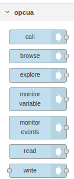
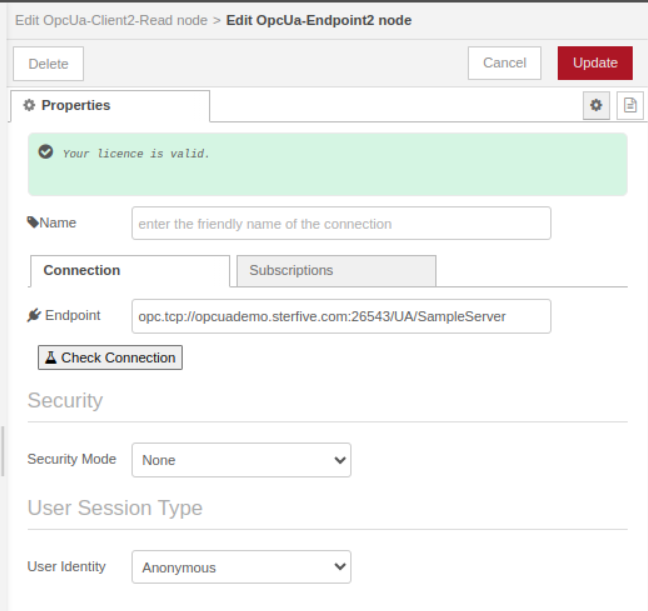
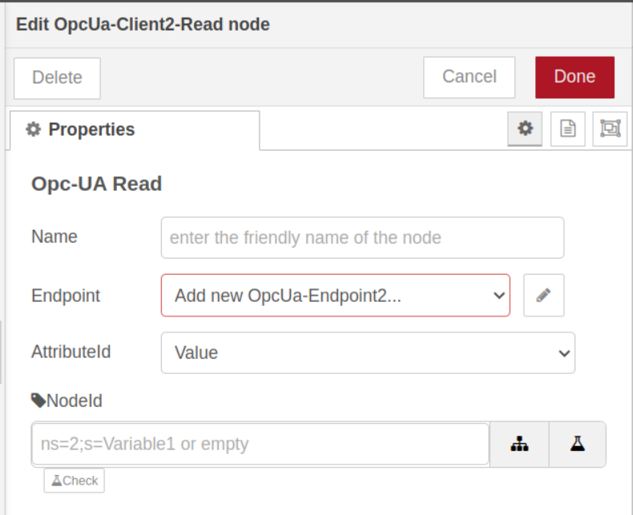
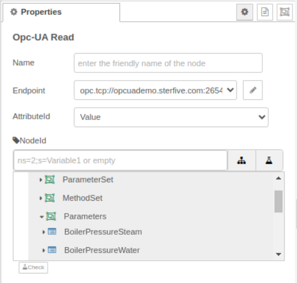

@opcua/for-node-red  (Preview Version)

:rotating_light: this product is currently provided as beta version. 


This node is the second next generation OPCUA Node for NodeRED build by Sterfive, the company that develops the [NodeOPCUA](https://node-opcua.github.io/) stack.

Ir brings the following OPCUA Client features 
- Read
- Write
- Browse
- Monitor
- Call

The community edition works with one connection to one OPCUA server and can hanldes up to 100 simulatenous operation per nodes. 

The professional edition works with multiple connections to multiple OPCUA servers and have no limitation on the number of simultaneous operations per nodes, exxcept the one imposed by the OPCUA server itself.

It has been designed with the following goals in mind:

- easy to use, easy to configure; no deep OPCUA knowledge required.
- provide visual tools to pick up nodeId by browsing the OPCUA server
- handle nodes address with either nodeId or browse path, or both. 
- works well with complex OPCUA servers, exposing complex data structures (extension objects)
- arbitraty number of node sharing the same connection
- support for multiple connections to multiple OPCUA servers.
- handles automatically transactions optimisation by grouping or splitting operations based on actual OPCUA server capabilities.
- handles automatically reconnections in case of network failure, in a way that works
- do not consume Client session unexpectedly on the OPCUA server side.
- handles automatically OPCUA server certificate management

## Getting Started 

To install the node execute the following command inside the `.node-red`` directory:

```console
npm install @opcua/for-node-red
```


### Node palette




### specifying a endpoint connection



> the `check connection` button allows you to immediatly test your connection parameters and provide useful feedback to help you fix commonly found issues. 


Three default subscriptions are automatically created for you: 
Default (1 seconde), Fast (500ms) and Slow(5 secondes). They provide differents publishing intervals for the most common scenarii we usually find in typical IIoT applications. You can customize the parameter or delete or add new subscriptions if you wish. 
Most of the time, only a few subscriptions are needed. 

Note: The default subscription cannot be deleted, it serves as a mechanism to keep the connection always active with the server by handligng a keepalive packet, and serves as well in the automatic reconnection mechanism, in case of a network outage. 


## setting up custom certificate

We provide a single PKI location shared with all Client connections.
The PKI is located in the following folder:

- Linux: `~/.node-red/opcua-for-node-red/PKI` folder
- macOS: `~/Library/Preferences/opcua-for-node-red-nodejs/PKI`
- Windows: `%APPDATA%\opcua-for-node-red-nodejs\PKI` (for example, `C:\Users\USERNAME\AppData\Roaming\opcua-for-node-red-nodejs\PKI`)


## Read



**NodeId** : you can specify here a nodeId or a browsePath (originated from the /Objects folder) or both.

For instance:

   - ns=1;s=Temperature
   - /2:MyDevice/1:MyTemperatureSensor/2:ParameterSet/3:Temperature
   - \[/2:MyDevice/1:MyTemperatureSensor/2:ParameterSet/3:Temperature\](ns=1;s=Temperature)


You can also client on the `...` button to browse the OPCUA server and pick up the nodeId you are interested in.




**Note**: NodeID can also be left empty, if you intend to inject the NodeId by the `topic` attribute of an Inject node or with a OpcUa-Item.


## Write

## Call

## Monitor Variable


## Monitor Event


## Getting access to the professional edition

- send your request to contact@sterfive.com to claim access to the professional edition 
 
 

